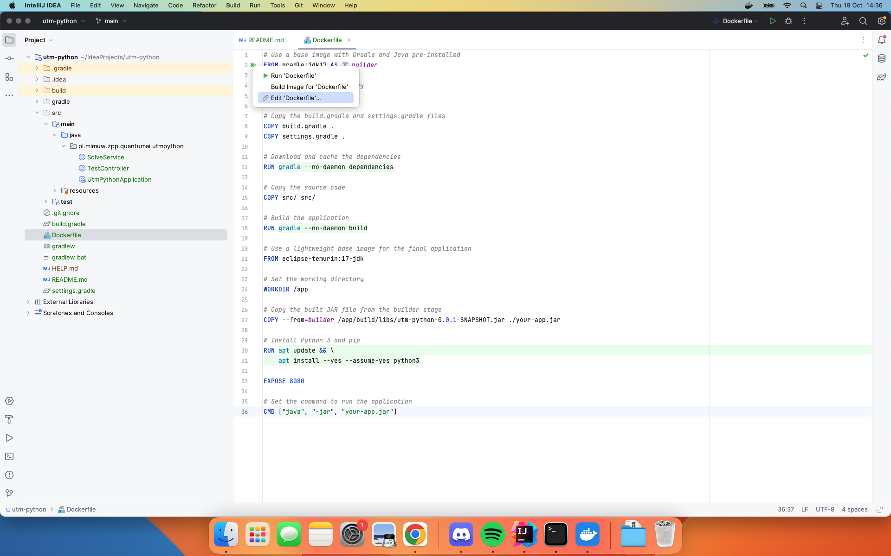

# Poradnik

## Jak uruchomić aplikację lokalnie

Do naszej aplikacji trzeba ustawić port. Pokażę jak to zrobić w IntelliJ, ale na luzie można znaleźć poradnik w necie, jakie komendy wpisać do terminala.

Na początku klikamy zieloną strzałeczkę przy Dockerfile i klikamy 'Edit Dockerfile'.

Przechodzimy do okna z edycją i klikamy 'Modify options' > 'Bind ports'

Ustawiamy host port na jaki nam się podoba (tutaj 8080, ale może być u was używany), a port kontenera ustawiamy na 8080.

Następnie klikamy 'Run'.

Możemy sprawdzić czy kontener chodzi w Docker Desktopie, albo przy użyciu `docker ps`.

> **_NOTE:_** Pamiętajmy, że zamiast każdorazowo przebudowywać kontener, możemy go wstrzymać klikając kwadracik pod 'Actions' w Docker Desktopie, a potem go wznowić.

## Jak korzystać z aplikacji

Wchodzimy na http://localhost:8080/swagger-ui.html (lub podmieniamy 8080 na inny port, który ustawiliśmy).

Rozwijamy '/solve' i tutaj możemy wrzucić plik pythonowy oraz input i zobaczyć co z tego wyjdzie. 
Alternatywnie można pisać z terminala poleceniem `curl`, ale moim zdaniem jest to dużo mniej wygodne.

## Have fun!